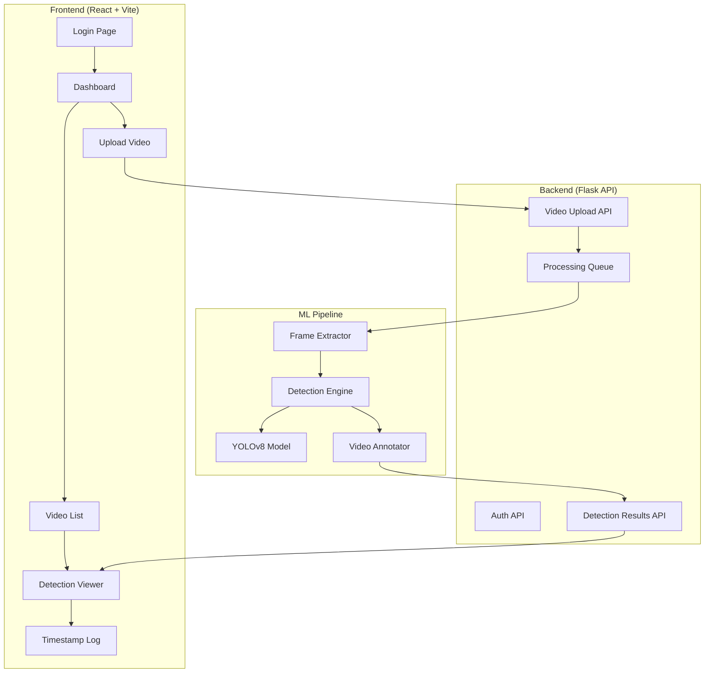

# Pothole Detection Web Application for LGUs — Prototype (75%)

## Background

Based on your thesis (Chapter 1), we're building a **web-based pothole detection system** that:
- Allows LGU personnel to **upload road survey videos**
- Processes videos **frame-by-frame using YOLOv8** to detect potholes
- Draws **bounding boxes** on detected potholes
- Generates a **clickable timestamp log** for quick review
- Targets **≥80% mAP** (previous school studies couldn't exceed 60%)

## 75% Prototype Scope

At 75% progress, the prototype will include:

| Feature | Status |
|---------|--------|
| YOLOv8 model trained on RDD2022 (pothole class only) | ✅ Included |
| Video upload interface | ✅ Included |
| Frame-by-frame video processing with detections | ✅ Included |
| Bounding box visualization on processed video | ✅ Included |
| Clickable detection timestamp log | ✅ Included |
| Dashboard with detection statistics | ✅ Included |
| User authentication (LGU login) | ✅ Basic version |
| Export detection report (PDF/CSV) | ❌ Remaining 25% |
| GPS/geolocation mapping integration | ❌ Remaining 25% |
| Multi-user role management | ❌ Remaining 25% |
| ISO 25010 evaluation survey | ❌ Remaining 25% |

---

## Tech Stack

| Layer | Technology |
|-------|-----------|
| **Frontend** | React + Vite (modern, fast dev experience) |
| **Styling** | Vanilla CSS with premium design system |
| **Backend** | Flask (Python) — already installed |
| **Database** | SQLite via SQLAlchemy — already installed |
| **ML Model** | YOLOv8 (Ultralytics) — needs install |
| **Video Processing** | OpenCV (cv2) — needs install |
| **Model Training** | PyTorch (already installed) + Ultralytics |

---

## Architecture

---

## Proposed Changes

### Phase 1: ML Model Training

> [!IMPORTANT]
> This is the most critical part — achieving ≥80% mAP on pothole detection. We'll use the **RDD2022 dataset** filtered to pothole classes only (D40 = potholes in RDD2022 taxonomy).

#### [NEW] `ml/train_model.py`
- Download and prepare the RDD2022 dataset (pothole class D40 only)
- Configure YOLOv8n (nano) for fast training and inference
- Train with data augmentation (mosaic, mixup, flips, HSV augmentation)
- Export best model weights to `ml/models/best.pt`
- Generate training metrics (mAP, precision, recall curves)

#### [NEW] `ml/dataset_prep.py`
- Script to download and filter RDD2022 dataset for pothole (D40) class
- Convert annotations to YOLO format
- Split into train/val/test (70/20/10)

#### [NEW] `ml/data.yaml`
- YOLOv8 dataset configuration file

---

### Phase 2: Backend (Flask API)

#### [NEW] `backend/app.py`
- Flask application factory with CORS support
- SQLAlchemy database setup
- Blueprint registration for modular routes

#### [NEW] `backend/models.py`
- `User` model (id, username, password_hash, lgu_name)
- `Video` model (id, filename, upload_date, status, user_id)
- `Detection` model (id, video_id, timestamp, confidence, bbox_data, frame_path)

#### [NEW] `backend/routes/auth.py`
- POST `/api/auth/login` — authenticate user
- POST `/api/auth/register` — register new LGU user
- GET `/api/auth/me` — get current user info

#### [NEW] `backend/routes/videos.py`
- POST `/api/videos/upload` — upload video file
- GET `/api/videos` — list all videos for current user
- GET `/api/videos/<id>` — get video details with detections
- DELETE `/api/videos/<id>` — delete video and associated data
- GET `/api/videos/<id>/processed` — serve processed video with bounding boxes

#### [NEW] `backend/routes/detections.py`
- GET `/api/detections/<video_id>` — get all detections for a video
- GET `/api/dashboard/stats` — aggregate statistics

#### [NEW] `backend/services/video_processor.py`
- Load YOLOv8 model
- Extract frames from uploaded video using OpenCV
- Run inference on each frame
- Draw bounding boxes on detected potholes
- Reassemble annotated frames into output video
- Save detection records (timestamp, confidence, bbox) to database

---

### Phase 3: Frontend (React + Vite)

#### [NEW] `frontend/` — Vite React project
- Premium dark-themed UI designed for government/infrastructure use
- Glassmorphism cards, smooth animations, modern typography (Inter font)

#### [NEW] `frontend/src/pages/LoginPage.jsx`
- Clean login form with LGU branding
- Registration option for new LGU accounts

#### [NEW] `frontend/src/pages/DashboardPage.jsx`
- Summary statistics cards (total videos, total detections, avg confidence)
- Recent uploads list
- Quick-action buttons

#### [NEW] `frontend/src/pages/UploadPage.jsx`
- Drag-and-drop video upload zone
- Upload progress indicator
- Processing status tracking (queued → processing → complete)

#### [NEW] `frontend/src/pages/VideoListPage.jsx`
- Grid/list view of all uploaded videos
- Status badges (processing, complete, failed)
- Search and filter

#### [NEW] `frontend/src/pages/DetectionViewerPage.jsx`
- **Left panel**: Processed video player with bounding boxes
- **Right panel**: Scrollable detection log with clickable timestamps
- Clicking a timestamp jumps the video to that exact moment
- Detection confidence display

#### [NEW] `frontend/src/components/`
- `Navbar.jsx` — Navigation with user info
- `VideoCard.jsx` — Video thumbnail card
- `DetectionLog.jsx` — Timestamp list component  
- `StatsCard.jsx` — Dashboard metric card
- `UploadZone.jsx` — Drag-and-drop upload component
- `ProcessingStatus.jsx` — Real-time processing indicator

#### [NEW] `frontend/src/index.css`
- Complete design system with CSS variables
- Dark theme with blue/teal accent colors
- Glassmorphism utilities
- Animation keyframes
- Responsive breakpoints

---

## User Review Required

> [!IMPORTANT]
> **Model Training Time**: Training YOLOv8 on the RDD2022 dataset will take significant time. On a CPU-only Mac, expect **4-8 hours** for a nano model with reduced epochs. Do you have access to a **GPU machine or Google Colab** for faster training?

> [!IMPORTANT]
> **Accuracy Target Clarification**: You mentioned accuracy `<80%` — did you mean the target accuracy should be **at least 80%** (≥80% mAP)? This is achievable with YOLOv8 + RDD2022 given proper augmentation. Previous studies in your school failing at 60% likely used smaller datasets or older architectures.

> [!WARNING]
> **RDD2022 Dataset**: The dataset is ~3.5GB. We'll need to download it. Do you already have this dataset, or should we download it from the official source?

## Open Questions

1. **LGU Branding**: Do you have a specific LGU name, logo, or color scheme you'd like used in the UI?
2. **Demo Data**: Should we include sample/demo videos for testing, or will you provide your own test videos?
3. **Deployment**: Will this prototype run locally only, or do you need it deployed to a server?
4. **Video Size Limits**: What's the maximum video file size LGU personnel would typically upload?

---

## Verification Plan

### Automated Tests
- Run YOLOv8 validation on test split → verify mAP ≥ 80%
- Test all API endpoints with sample requests
- Verify video upload → processing → detection pipeline end-to-end

### Manual Verification
- Upload a sample road survey video
- Verify bounding boxes appear on potholes in the processed video
- Verify clickable timestamp log navigates to correct video moments
- Test login/registration flow
- Review UI responsiveness and design quality
